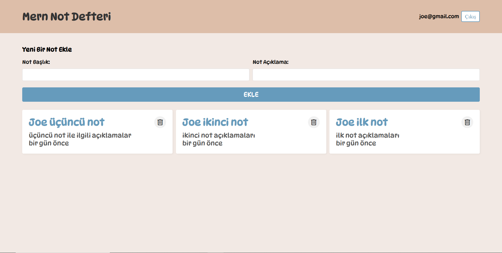
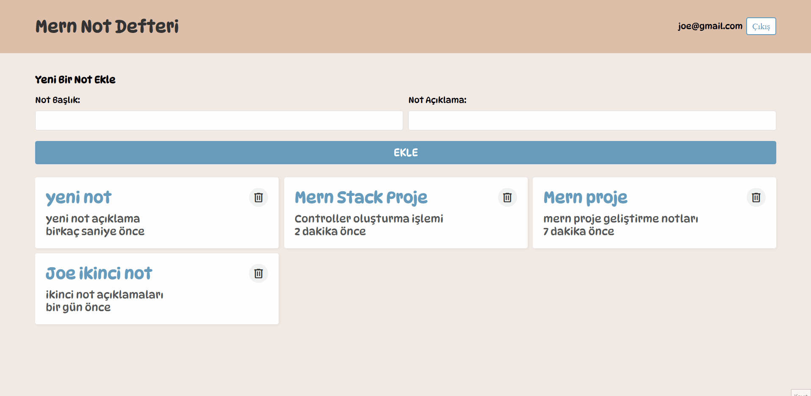

# Mern Notes App Project
A note application developed with Mern Stack. In the application, users can become members of the system and perform database operations with MongoDB. Users can add, list, update and delete (CRUD) operations on their notes.

# Technologies used in the project
- HTML
- CSS
- JavaScript
- React
- MongoDB
- ExpressJS
- NodeJS

# Screenshot

# GIF

